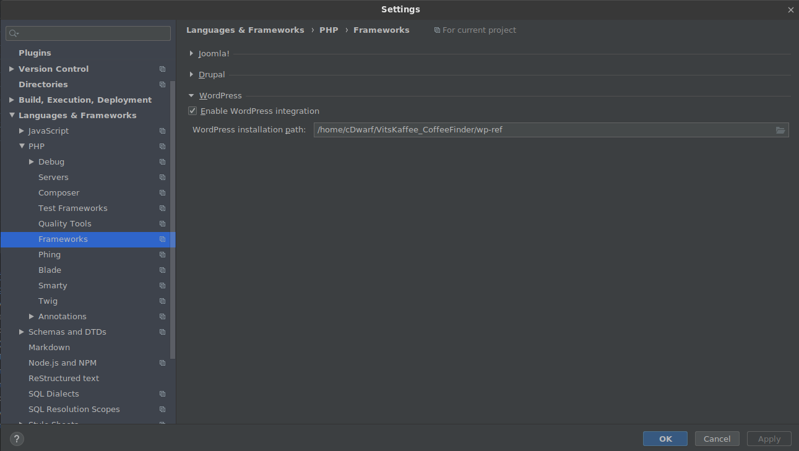
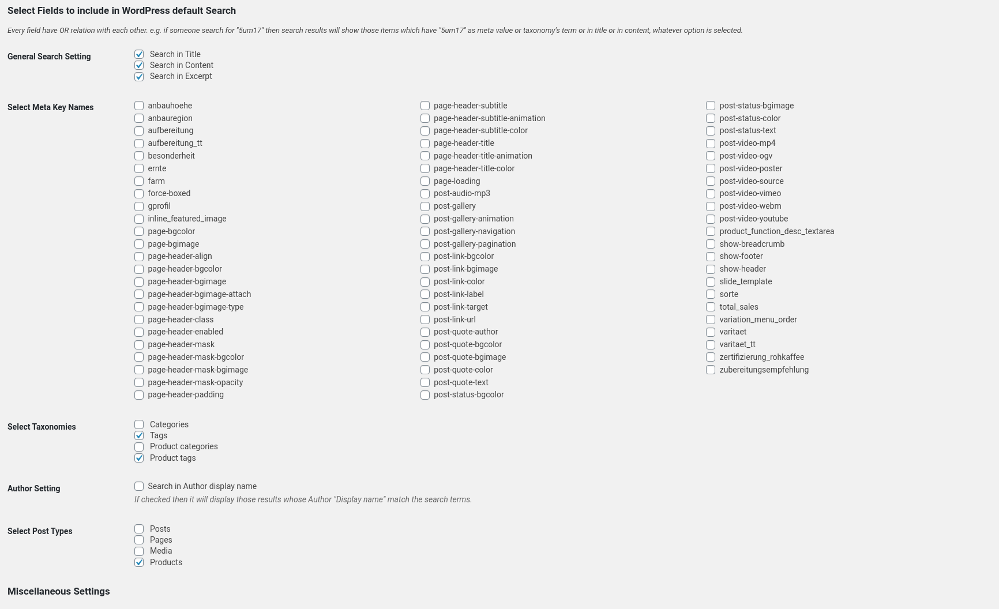

# VitsKaffee_CoffeeFinder

## IDE setup
- Install WP Cli
    ```
    curl -O https://raw.githubusercontent.com/wp-cli/builds/gh-pages/phar/wp-cli.phar
    chmod +x wp-cli.phar
    sudo mv wp-cli.phar /usr/local/bin/wp
    ```
- Install Wordpress reference for IDE autocompletes:
    ```
    wp core download --path=./wp-ref
    ```
  
- Install a local Php interpreter
- Install the wordpress plugin in PHPStorm: https://plugins.jetbrains.com/plugin/7434-wordpress
- Configure the Plugin:  

## Docker test setup

Please ensure your Docker installation has set any DNS server.

```shell script
docker-compose up
docker exec -ti wordpress /bin/bash /root/bootstrap-wp.sh
```

You will get your instance under http://localhost:8080 and should be able to configure it.
All credentials are wordpress:wordpress.

To initialize the Installation, go to http://localhost:8080/wp-admin/edit.php?post_type=product&page=product_importer and import the files in the `_seed` folder. Keep in mind that headers of the csv files are translated! The file in this repository are using English file headers. If you install Wordpress in a different language, you might need to use different headers. Otherwise the automatic mapping wont't work and you will miss fields.
If the headers are correct, you don't have to do anything. Otherwise you need to fix the mapping one by one.

After import configure the extended search plugin as depicted here:  


In case of any errors (and if you have no other important docker container/images on your rig):
```shell script
docker kill $(docker ps -q)
docker system prune -a
docker volume rm $(docker volume ls -q)
```

Unfortunately this setup does not run with podman or podman-compose yet

